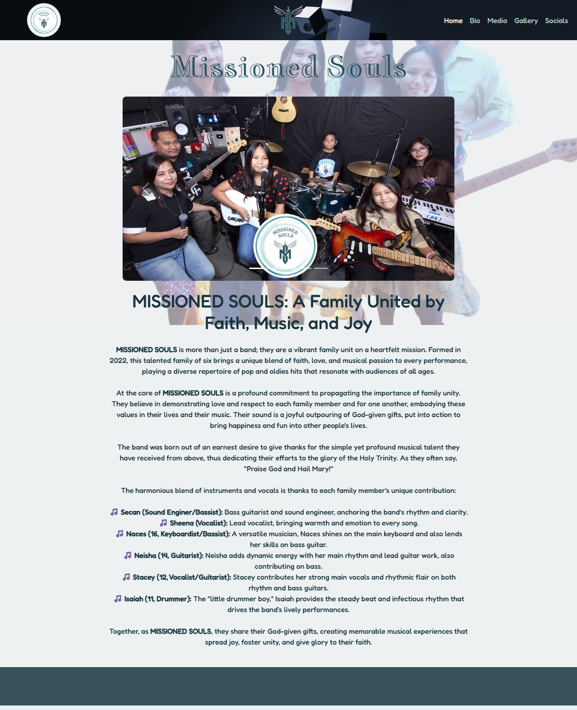
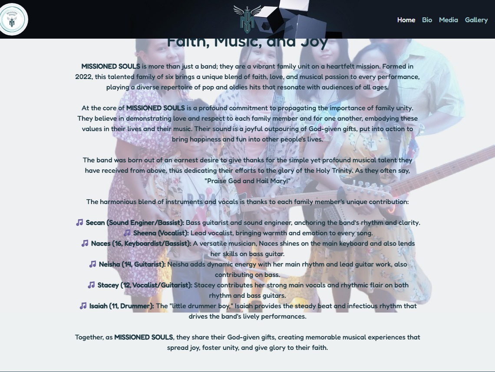
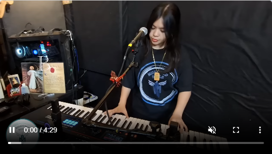
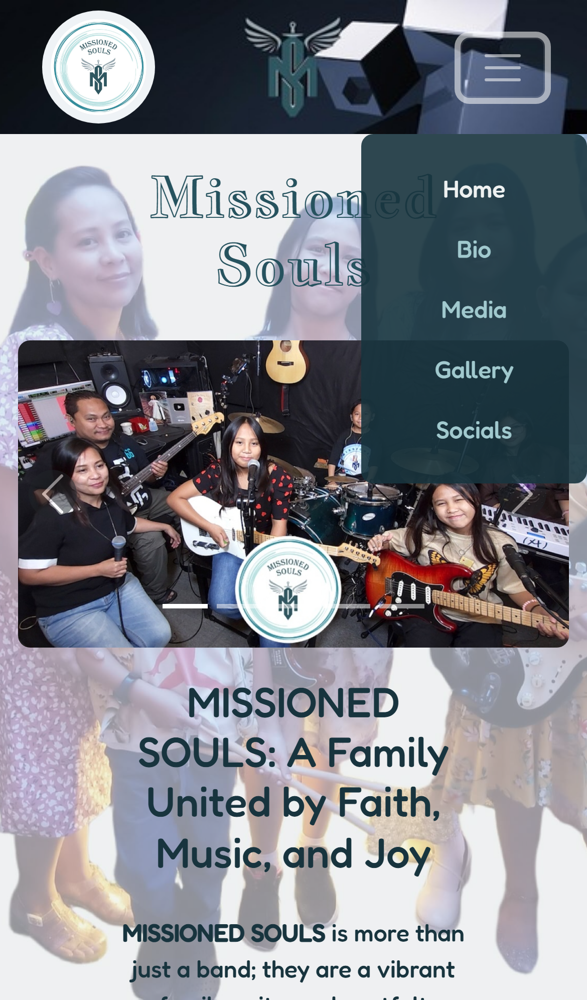

# Missioned Souls

[Link to project](https://meta1ingus.github.io/missioned-souls/)

MISSIONED SOULS is small website created with the purpose of making others aware of sucha a talented family band. The site gives a brief description of the band and showcases a select few videos of their cover songs and a selection of photos of the band.  The site consists of 3 pages to meet the owner and user goals of which are described in the User Experience section.

## Table of Contents

- [Introduction](#introduction)
- [User Experience](#user-experience)
    - [Project goals](#project-goals)
    - [Site owner's goals](#site-owners-goals)
    - [External user goals](#external-user-goals)
    - [User stories](#user-stories)
    - [Wireframes](#wireframes)
    - [Design choices](#design-choices)
    - [Features](#features)
    - [Key-features to meet the goals](#key-features-to-meet-the-goals)
    - [User Story Demonstration](#user-story-demonstration)
- [Technologies](#technologies)
    - [Tools](#tools)
- [Testing](#testing)
    - [Validation](#validation)
    - [Lighthouse](#lighthouse)
    - [Manual Testing](#manual-testing)
    - [Browser Testing](#browser-testing)
    - [Bugs](#bugs)
- [Deployment](#deployment)
- [Credits](#credits)
    - [Media](#media)

## Introduction

Welcome to **MISSIONED SOULS**, an unofficial website dedicated to bringing you closer to the band. Here, you’ll find a collection of videos showcasing their performances, allowing you to hear and see the band in action. Whether you’re a fan looking to connect or an event organizer searching for talent, you can explore their social links and easily reach out for potential bookings. Discover the sound, experience the energy, and join the journey of **MISSIONED SOULS**.

This website provides information to potential clients. A visitor will be able to watch a few videos, view a selection high quality pictures, and be directed to MISSIONED SOULS' contact information and social media links.

## User Experience

### User Stories

- As a First-Time Visitor, I need easy navigation and a user-friendly design, including a responsive layout for my device, so I can find information quickly and efficiently without frustration.
- As a fan of music, I want to know about the band, I want to see high-quality images and see a selection of videos of the band performing.
- As a fan of music, I want to be able to see/hear some of the bands music on the website, so I can decide whether to engage with their socials and potentially book them for an event.
- As a potential customer, I want to see essential information such as location, contact details, and social links clearly and concisely, so I can easily get in touch with the band.

### Project goals

The goal of MISSIONED SOULS is to create a website to help bring awareness to the band. By providing a page of videos for the user to view to see the band performing, users can then go onto the band's social links and decide if they want to go on to contact the band for possible events.

### Site owner's goals

- Increase awarenwss of the band
- Easy administration

### External user goals

- Information and the socials for the band
- See the bands performances
- See a selection of pictures

### User stories

#### As a site owner

- I want to increase band awareness

#### As a user

- First-Time Visitor: Needs intuitive navigation, a user-friendly design, and a responsive layout for quick, frustration-free access to information
- Music Fan (Band Info): Wants high-quality images and performance videos to learn about the band
- Music Fan (Listening Experience): Hopes to stream the band’s music to decide on engagement
- Potential Customer: Requires clear contact details, location and social links for easy communication with the band

### Features

#### Key-features to meet the goals

- To ensure a responsive design and user-friendly interface, by applying a mobile-first approach
- There are a section on the home page contatining information about the band
- There is an easily accesible navigation bar in the browser and a hamburger menu for phone and small screens in the upper right corner for easy access and recognition for the user on all pages.
- There is a second page (_Media_) where users can watch several performances of the band
- There is a third page (_Gallery_) to access a selection of photos of the band
- The Social Media links and contact information (_e-mail_) is placed in the footer

### User Story Demonstration

This project uses targeted screenshots to visually confirm that the user stories outlined in the planning phase are met through the site’s structure, responsiveness, and content.

---

#### 🧭 First-Time Visitor

- Clear, user-friendly homepage layout with consistent navigation across devices  
  

#### 📝 Music Fan – About the Band

- Dedicated bio section introducing the group and their story  
  

#### 🎬 Music Fan – Listening Experience

- Performance video embedded and fully playable from the Media page  
  

#### 🖼️ Music Fan – Gallery

- Grid-style layout showcasing high-quality images of the band  
  

#### 📬 Potential Customer

- Contact details and social media links placed accessibly in the footer  
  

#### 📱 Responsive Design Preview

- Mobile dropdown menu activates and displays navigation links clearly  
  

---

These screenshots were captured with [Playwright](https://playwright.dev/) using scripted user flows. They validate both functionality and responsiveness while reflecting the intent behind each user story.

### Wireframes

#### Mobile

* [Home](https://res.cloudinary.com/dvsifzmes/image/upload/Mobile_Home_owf4dp.png)
* [Media](https://res.cloudinary.com/dvsifzmes/image/upload/Mobile_Media_y7t1db.png)
* [Gallery](https://res.cloudinary.com/dvsifzmes/image/upload/Mobile_Gallery_repjbu.png)

#### Tablet

* [Home](https://res.cloudinary.com/dvsifzmes/image/upload/Tablet_Home_gqfzxs.png)
* [Media](https://res.cloudinary.com/dvsifzmes/image/upload/Tablet_Media_xaifir)
* [Gallery](https://res.cloudinary.com/dvsifzmes/image/upload/Tablet_Gallery_rhs9tu)

#### Desktop

* [Home](https://res.cloudinary.com/dvsifzmes/image/upload/Desktop_Home_vxi1bc)
* [Media](https://res.cloudinary.com/dvsifzmes/image/upload/Desktop_Media_pzkjhe)
* [Gallery](https://res.cloudinary.com/dvsifzmes/image/upload/Desktop_Gallery_uxy6cm)

#### Design choices

The design style chosen for the project is in a modern, minimalist aesthetic to alingn with the band logo

### Website Structure

The website consists of three pages: Home, Media, and Gallery, The Home page contains the bulk of the content with 2 different sections: 5 Images in an auto rotating carousel, and a Bio section. The navbar is in a fixed position, so that it's visable to allow access to navigation at all times. The footer is static on all pages with easy acces from the provided link in the navbar.

### Colour Scheme

The above colour palette, inspired by the photos of the bands logo featured on the website, is used throughout the project.

Midnight Green (#26525e)

I used this for the main heading.

Anti-flash White (#eef1f1)

Serves as the main background colour for the body and as the highlight colour for the active navigation links

Light Blue (#a1c9ce)

Used for the general navigation link text and social network icons

Gunmetal (#18343e)

Used for the bio section text and as the fallback background colour for the navbar

### Typography

- 'Fredoka' sans-serif Google font is applied as the main font for the entire body of the website and used for the text in the navigation links
- 'Jacques Francois Shadow' sans-serif Google font is used for the headings throguhout the website.
- Font Awesome icons have been used for social media links in the footer.

### Images

To optimize the site, I compressed local images used with the tool TinyPNG (see tools) Images for the (_Gallery_) page were uploaded to Cloudinary (see tools) rather than hosted locally. This decision was made to ensure faster loading times, responsive delivery across all devices, and streamlined image management, thanks to Cloudinary's powerful optimisation capabilities and global content delivery network.

---

## Technologies

For this project, GitHub was used to host the repository, and VS Code served as the integrated development environment (IDE). To ensure the site is fully responsive and to manage development time effectively, the Bootstrap framework was utilised.

- This project includes HTML and CSS language
- I also installed the extension Prettier - formatter to format the code

### Tools

Here is a breakdown of the tools, resources, and learning materials that were instrumental in this project:

| Source | Category | Notes |
| :-------------------------------------------------------------------------------------------- | :------------------------- | :---------------------------------------------------------------------------------------------------------------------------------------- |
| [Balsamiq](https://balsamiq.com/) | Design (Wireframing) | Used to create the wireframes, which are linked within the `README.md`. |
| [Stack Overflow](https://stackoverflow.com/) | Development Support | Referenced for various syntax queries. |
| [Image Color Picker](https://imagecolorpicker.com/) | Design (Colour Palette) | A handy tool for selecting colours for the project's palette. |
| [WebAIM Contrast Checker](https://webaim.org/resources/contrastchecker/) | Accessibility (Colour) | Utilised to ensure sufficient colour contrast for visually impaired users. |
| [Google Fonts](https://fonts.google.com/) | Development (Fonts) | Provided embedded code for incorporating chosen fonts into the project. |
| [Bootstrap](https://getbootstrap.com/) | Framework (Front-end) | Crucial for achieving responsive design across all devices and providing ready-made UI elements throughout the site. |
| [TinyPNG](https://tinypng.com/) | Optimisation (Images) | Used to compress local images, enhancing overall site performance. |
| [GitHub](https://github.com/) | Project Hosting | The platform used to host the entire project repository. |
| [W3C HTML Validator](https://validator.w3.org/#validate_by_input) | Validation (HTML) | Employed to check HTML code for errors and ensure compliance with web standards. |
| [W3C CSS Validator](https://jigsaw.w3.org/css-validator/#validate_by_input) | Validation (CSS) | Used to check CSS code for errors and maintain compliance with standards. |
| [Beautify](https://marketplace.visualstudio.com/items?itemName=HookyQR.beautify) | Development (Formatting) | A VS Code extension used for formatting the HTML files. |
| [W3Schools](https://www.w3schools.com/) | Reference (Syntax) | Valuble for its straightforward guides and interactive examples for various web development languages and technologies. |
| [Stack Overflow](https://stackoverflow.com/questions) | Reference | A community-driven Q&A platform where developers ask and vote on technical solutions, serving as an invaluable resource for problem-solving and knowledge sharing. |
| [Cloudflare](https://www.cloudflare.com/) | Video Hosting | A dedicated service that optimises video hosting and delivery. It handles storage, encoding, and global content distribution to ensure fast loading and smooth, adaptive playback for viewers worldwide. |
| [Cloudinary](https://cloudinary.com/) | Image Hosting | A comprehensive cloud-based platform for image management. It enables automated optimisation, dynamic transformations, and rapid delivery of photos through a global CDN, ensuring optimal performance and responsiveness across all devices. |
| [Autoprefixer CSS online](https://autoprefixer.github.io/) | Development Utility | A post-processor tool that automatically adds, and removes, vendor prefixes to the CSS rules. This ensures broader cross-browser compatibility for modern CSS features without requiring manual upkeep of prefixes. |
| [Playwright](https://playwright.dev/) | Testing Utility | A Node.js-based tool used to automate browser actions.|

---

## Testing

### Validation

To validate the code, I used W3C validation sevice (see tools).

## Lighthouse

### HTML

## index.html errors and clearance

Initially, `index.html` presented a validation error.

### Initial Errors:
This image highlights the error identified in the initial validation pass of `index.html`.

* **Error Screenshot 1: Structure Issue**
        
        * *This image shows the error related to missing headings in sections.*

After careful review and adjustments, all identified issues were successfully resolved. The validation report now shows a clean status.

### Cleared Status:

This image confirms that `index.html` now passes W3C validation without any errors or warnings.

* **Cleared Screenshot 1:**
        
        * *The validation report showing a clean bill of health for `index.html`*

## media.html errors and clearance

Initially, `media.html` presented a significant number of validation errors. These issues primarily stemmed from incorrect attribute formatting within the <video> tags and invalid type values in the <source> tags. This formatting was brought on by using a different HTML formatter before using Beautify again.

### Initial Errors:
These 8 screenshots detail the various errors identified in the initial validation pass of `media.html`.

* **Error Screenshot 1: Duplicate Attribute**
        
        * *This image highlights the first instance of a duplicated attribute (spacing) within a video tag.*

* **Error Screenshot 2: Duplicate Attribute (cont.)**
        
        * *Another instance of the attribute (spacing) appearing multiple times in a video element.*

* **Error Screenshot 3: Duplicate Attribute (cont.)**
        
        * *Another instance of the attribute (spacing) appearing multiple times in a video element and an error where the 'type' attribute for the WebM and MP4 sources had an invalid value (e.g., a trailing semicolon).*

* **Error Screenshot 4: Duplicate Attribute (cont.)**
        
        * *Another instance of the attribute (spacing) appearing multiple times in a video element.*

* **Error Screenshot 5: Duplicate Attribute (cont.)**
        
        * *Another instance of the attribute (spacing) appearing multiple times in a video element.*

* **Error Screenshot 6: Duplicate Attribute (cont.)**
        
        * *Another instance of the attribute (spacing) appearing multiple times in a video element and an error where the 'type' attribute for the WebM and MP4 sources had an invalid value (e.g., a trailing semicolon).*

* **Error Screenshot 7: Duplicate Attribute (cont.)**
        
        * *Another instance of the attribute (spacing) appearing multiple times in a video element.*

* **Error Screenshot 8: Duplicate Attribute (cont.)**
        
        * *Another instance of the attribute (spacing) appearing multiple times in a video element and an error where the 'type' attribute for the WebM and MP4 sources had an invalid value (e.g., a trailing semicolon).*

After extensive review and adjustments (specifically addressing duplicate and malformed attributes, and correcting source type values by removing trailing semicolons), all identified issues were successfully resolved. The validation report now shows a clean status.

### Cleared Status:

This image confirms that `media.html` now passes W3C validation without any errors or warnings.

* **Cleared Screenshot 1:**
        
        * *The validation report showing a clean bill of health for `media.html`*

**gallery.html errors and clearance**

Upon initial validation, `gallery.html` was found to have no errors or warnings, indicating a clean and compliant HTML structure from the outset.

### Cleared Status:

This screenshot confirms that `gallery.html` passes W3C validation without any issues.

* **Cleared Screenshot 1:**
        
        * *The validation report showing a clean bill of health for `gallery.html`*

Upon initial validation, `styles.css` was found to have no errors or warnings, indicating a clean and compliant CSS structure from the outset.

### Cleared Status:
This screenshot confirms that `styles.css` passes W3C validation without any issues.

* **Cleared Screenshot 1:**
        
        * *The validation report showing a clean bill of health for `styles.css`*

### Deprecated API Warning

  

While manual testing using the **in-browser Lighthouse tool**, both `index.html` and `media.html` received a **Best Practices score of 81** due to a **deprecated API**. The same warning can be found on the `gallery.html` but the are is also another issue (see below).

My project aims to follow **modern web best practices**, and during testing, a browser warning appeared regarding the **deprecated `unload` JavaScript event**, originating from `contentInject.js`.  

### Understanding the `unload` Event  

The `unload` event is an older, **unreliable feature** that can negatively impact browser performance by preventing the use of **back/forward cache (bfcache)**.  

Critically, `contentInject.js` is **not part of my project's codebase**; instead, it is typically an **injected script from browser extensions or development tools**.

### Why This is Not an Issue  

Since the warning originates **outside** my application’s codebase, it does **not** indicate an issue with **my website's functionality or performance**.  

I ensure that:
- **My code adheres to current standards**, prioritising **user experience** and **efficient browser navigation**.
- The presence of this warning does **not** imply a security risk or breaking change to my website.  

This documentation provides **clarity** on the nature of the warning and reinforces my commitment to **maintaining high coding standards**.

## Third-Party Cookies & Cloudinary

My website utilizes Cloudinary as a Content Delivery Network (CDN) to host and serve image assets. When content is embedded from Cloudinary, third-party cookies are set in the user's browser, currently totaling 11 cookies from `res.cloudinary.com`. These cookies, such as `_cfuvid`, `_cld_session_key`, and `__cf_bm`, are primarily for Cloudinary's operational purposes (e.g., session management, security, performance optimization) and are not used by my application for user tracking or advertising.

Modern browsers (Chrome, Firefox, Safari) are increasingly restricting third-party cookies due to privacy concerns, aiming to reduce cross-site tracking. This means some of these cookies may be blocked depending on browser settings and future updates.

### My Approach & Considerations

While these cookies are not a critical issue for this project, I acknowledge their presence and consider the following factors:

- **Operational Necessity**: Cloudinary’s cookies ensure efficient and secure delivery of media. My application does not use them for user tracking or advertising purposes.
- **External Control**: Since these cookies are part of Cloudinary’s service infrastructure, I cannot directly modify or remove them.
- **Industry Evolution**: I am actively monitoring privacy-preserving technologies, including Google’s Privacy Sandbox, which aims to reduce reliance on third-party cookies.
- **Performance vs. Privacy Trade-off**: Self-hosting media would remove third-party cookies, but it comes at a cost to performance, scalability, and automatic optimizations that Cloudinary provides. In this project, the benefits of a CDN outweigh the implications of third-party cookies.

### Transparency & User Options

For transparency, users can manage their cookie preferences via browser settings. Most modern browsers allow control over third-party cookies through privacy configurations.

## Accessibility & SEO Improvement: Descriptive Link Text for Buttons

### Issue
Lighthouse flagged generic link text such as **"More"** on buttons, indicating a lack of context for screen readers and search engines. This hindered accessibility and SEO by making it unclear where the links lead.

### Fix
The text for all **"More"** buttons leading to external YouTube videos was updated to be highly descriptive. The generic "More" was replaced with clear, contextual phrases:

- **Watch "[Video Title]" on YouTube**

This provides immediate clarity on the link's destination and content, benefiting both **usability** and **search engine optimization**.

### Example Before & After

**Before:**
### HTML
<a href="https://www.youtube.com/watch?v=QWPZC6uk3hM" class="btn btn-primary">More</a>

**After:**
#### HTML
<a href="https://www.youtube.com/watch?v=QWPZC6uk3hM" class="btn btn-primary" target="_blank">Watch "Bad Medicine" on YouTube</a>

## Benefits of the Fix
**Enhanced accessibility** – Screen readers now convey meaningful link destinations.  
**Improved SEO** – Search engines gain clearer understanding of the linked content.  
**Better user experience** – Users instantly know where the link leads without ambiguity.  

By implementing these changes, the website aligns better with best practices for **web accessibility** and **search engine optimization**, while maintaining a user-friendly experience.

## Manual Testing

| Feature                          | Expect                                                                            | Action                                                                               | Result                                                                                     |
| -------------------------------- | --------------------------------------------------------------------------------- | ------------------------------------------------------------------------------------ | ------------------------------------------------------------------------------------------ |
| Carousel                         | Carousel should change images when clicking the arrows                            | Clicking the left or right arrow keys in the carousel on the games page              | Image is being changed                                                                     |
| Video player           | Video should play when play button is clicked                                        | Click on play        | Video plays                                      |
| Video player | Sound plays after unmuting video while its playing                                    | Click speaker icon to unmute | Sound plays along when the video is playing |
| Video player | Clicking button opens respective video on YouTube                                    | Click Watch "SONG NAME" on YouTube button | Video opens, in new tab, on the bands YouTube channel |
| Video player | Video is downloaded when user clicks download                                   | Click 3 dots icon in bottom right corner to bring up a menu to allow video to be downloaded locally | Video downloads |
| Mail link in footer              | Clicking the email link in the footer should open the users preferred mail client | On any page, use navigation link for socials in navbar to be directed to the email icon in the footer and click the icon                           | The mail client is opened                                                                  |
| Social links                     | Clicking the any of social links should open their respectove social media pages             | On any page, use navigation link in navbar to be directed to the social links in the footer and click the respective social media icon                          | Respective social media for band is opened in a new tab                                                           |

## Browser Testing

**Layout:** Make sure the layout looks the same across all browsers

**Functionality:** All links and navigation workes as intended

| Browser | Layout               | Functionality |
| ------- | -------------------- | ------------- |
| Chrome  | ✔️                   | ✔️            |
| Firefox | ✔️                   | ✔️            |
| Edge    | ✔️                   | ✔️            |
| Safari  | No access to browser | -             |

## Bugs

**Body height in relation to navbar**

- When creating the main content of the body, I forgot to take into consideration the _fixed_ position of the navbar. I used the in-browser developers tool to determine the height of the navbar (_89px_) and then applied it to the body CSS code

_Problem_

_Solution_

**Rendered wrong size logo**

- When I added the image for the logo to the code of the navbar, I initially used the wron image thus making the image appear a whole lot larger than the dimentions of the displayed navbar' I then added the image I intended to use to the code and had a correctly displayed logo. Going forward in future projects/builds i need a clearer naming convention for images so i can identify the correct image just by the _Filename_

_Problem_

_Solution_

**Rendered wrong size logo**

- When I was testing my project using the _Lighthouse_ tool on the `media.html` page, it brought to my attention a lot of _duplicate attribute_ errors in the code. Even though the code did't affect the display output of the page, it flagged multiple attribute errors in the **W3C HTML Validator**. This was due to using the [Prettier - Code formatter](https://open-vsx.org/vscode/item?itemName=esbenp.prettier-vscode) tool in VS Code. I manually went through the whole body correcting each line of the code, seperating each attribute to a separate line. After this change, the validator showed no errors.

_Problem_

- [See images of the problem](#mediahtml-errors-and-clearance)

_Solution_

---

## Deployment

- While working on building the `index.html`, `media.html`, and `gallery.html` I consistantly committed and pushed the changes I made to the code to my GitHub repository. I decided to deploy early since it's recommended in the tutorials provided by the Code Institute to compare both the local and the live deployments to discover bugs or other problems early.

* **Prepare Your Project for GitHub:** Add all your project files, commit them with a descriptive message, and then upload them to your GitHub repository.

* **Access Repository Settings:** On your GitHub repository page, find and click on the _Settings_ tab.

* **Navigate to GitHub Pages:** In the left-hand menu of the settings page, click on _Pages_.

* **Set Up Deployment Source:** Under _Source_, choose the option _Deploy from a branch_" Then, select _main_ (or _master_) from the dropdown menu and click _Save_.

* **Monitor Deployment Progress:** Go to the _Actions_ tab in your repository. Wait for the deployment workflow to finish running. This usually takes a few minutes.

* **Find Your Deployed Site:** Once the _Actions_ workflow is complete, go back to the _<> Code_ tab of your repository. You'll see a link to your newly deployed website.

* **Verify Your Website:** Click on the provided link to open your website. Make sure everything looks correct and functions as expected.

---

## Credits

### Media

| Source                                   | Location                    | Type                   | Notes                                                                                                 |
| ---------------------------------------- | --------------------------- | ---------------------- | ----------------------------------------------------------------------------------------------------- |
| [MISSIONED SOULS](https://www.facebook.com/missionedsouls/photos_by)      | Photos            | image                 | I used seveal images, including logo, to use on the site. I recieved permission from the family to use images that are publically available on the social media sites                                                 |
| [Videos](https://www.youtube.com/@MissionedSouls) | Videos             | video                  | I used four videos to use as hard copies on the site. I recieved permission from the family to download videos locally using YouTube Premium to the convert into web-friendly MP4 and WebM formats.                                                                               |
| [Font awesome](https://fontawesome.com/) | Social Media Icons             | Icons                  | Used to insert social media icons.                                                                                 |                                                                           |
| [Gemini](https://gemini.google.com/)          | ALT descriptions `gallery.html` | Description | I used **Gemini** to help with generating _alt_ descriptions by having cloudinary auto generate tags for the images on the `gallery.html` page. |
| [Playwright](https://playwright.dev/) | Site-wide | Automated screenshots | I used **Playwright** to simulate realistic user interactions and capture screenshots that demonstrate how the site satisfies key user stories across desktop and mobile views. |
